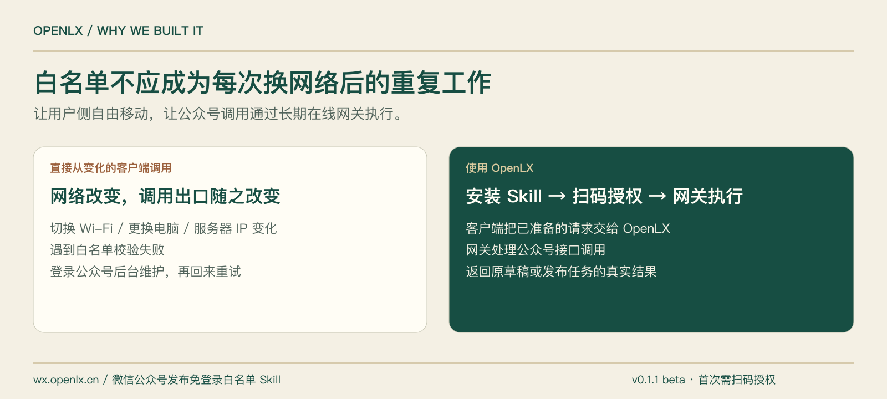
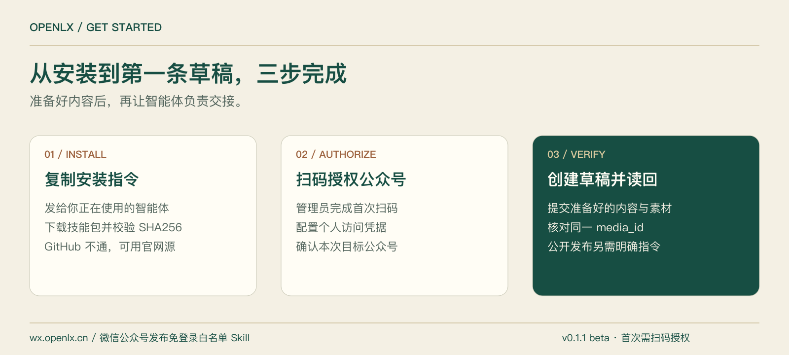
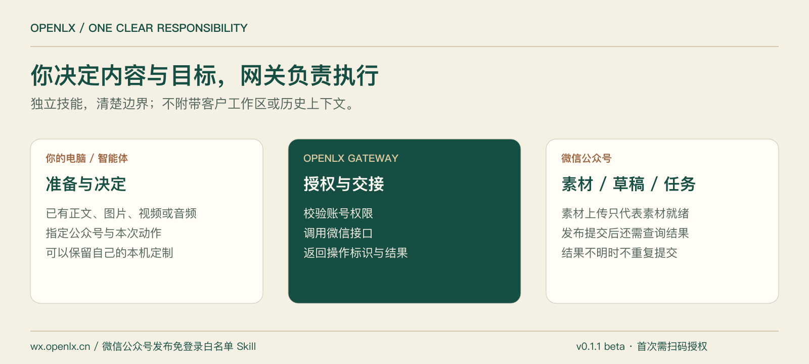

<p align="center"><a href="https://wx.openlx.cn/skills/openlx-weixin-baimindan"></a></p>

# OpenLX 微信公众号发布免登录白名单 Skill

**把准备好的内容交给智能体，把公众号接口调用交给长期在线的 OpenLX 网关。**

[](https://github.com/openlxcn/openlx-weixin-baimindan/releases/tag/v0.1.1)
[](https://github.com/openlxcn/openlx-weixin-baimindan/actions/workflows/ci.yml)
[](LICENSE)

[官网体验](https://wx.openlx.cn/skills/openlx-weixin-baimindan) · [一键安装](#一键安装给智能体一句话) · [直接安装](#直接安装选择你的电脑) · [功能](#它能做什么) · [使用示例](#安装后怎样使用) · [服务群与联系](#服务群与联系) · [English](README.en.md)

[Claude / Cursor 插件安装说明](PLUGIN_INSTALL.md)

## 为什么开发它

内容已经准备好了，却因为换了电脑、切换 Wi-Fi、外出办公或服务器 IP 变化，卡在公众号接口白名单上：重新登录后台、确认出口 IP、维护白名单，再回来重试。

OpenLX 把这段重复工作交给长期在线的网关。管理员首次扫码授权后，智能体把指定公众号的请求交给网关执行；用户侧网络变化不再要求跟着修改公众号后台调用 IP 白名单。**“免登录白名单”指免反复登录维护，并不免除首次授权、授权续期或微信平台权限。**



## 它能做什么

| 你已经准备好的内容 | Skill 执行动作 | 返回什么 |
|---|---|---|
| 公众号图文与封面 | 上传微信图片素材、创建草稿、明确提交发布 | 草稿 `media_id`、提交 `publish_id` 与对应状态 |
| 小绿书图片消息 | 按指定顺序交接图片与文字，创建草稿或明确提交 | 图片数量、草稿或发布任务标识 |
| 微信原文转载 | 根据用户指定且有权转载的原文执行 | 对应草稿或发布任务标识 |
| 已有公众号草稿 | 按本次明确指令提交，查询同一任务 | `publish_id` 与查询结果 |
| 视频、声音、播客音频 | 将准备好的文件上传为微信素材 | 素材 `media_id`；当前不等同于公开发布 |
| 授权与执行检查 | 检查接口授权，读取原草稿或发布任务 | 真实可用状态、失败原因或能力限制 |

播客使用已准备的音频或指定微信原文，不自动订阅或抓取节目。具体能力受目标公众号的接口权限约束。当前版本为 **v0.1.1 测试版 / GitHub Pre-release**。

## 一键安装：给智能体一句话

**如果电脑里已经安装了以下智能体，直接复制这段话给它：**

WorkBuddy · 豆包办公 · 千问办公 · 百度搭子 · ZCode · Trae Work · Qoder · Codex · Claude Code · Cursor

```text
请帮我安装「OpenLX 微信公众号发布免登录白名单 Skill」。
官网：https://wx.openlx.cn/skills/openlx-weixin-baimindan
GitHub：https://github.com/openlxcn/openlx-weixin-baimindan
请读取官网 Manifest：https://wx.openlx.cn/api/skills/openlx-weixin-baimindan/manifest
下载最新测试版并核验 SHA256。如果 GitHub 无法访问或要求登录，不必登录 GitHub，直接使用 Manifest 中的 official_mirror_url 从官网下载。
按当前智能体支持的方式安装；已有版本先检查本地修改并备份，不覆盖本机定制。安装后检查技能能否加载，告诉我如何扫码授权公众号。本次只安装，不提交或发布任何内容。
```

| 安装方式 | 适用智能体 | 验证说明 |
|---|---|---|
| 首方安装器自动落位 | Codex、Claude Code、Cursor | 已完成实际安装与加载检查；参数分别为 `codex`、`claude`、`cursor` |
| 宿主自身技能导入 | WorkBuddy、豆包办公、千问办公、百度搭子、ZCode、Trae Work、Qoder | 团队实测可用、Owner 确认；采用各宿主支持的导入方式 |
| 通用目录导入 | 其他支持 `SKILL.md` 的智能体 | 格式可供导入；未逐一验证的宿主不承诺自动落位 |

完整记录见 [兼容矩阵](compatibility-matrix.json)。此 Skill 不绑定特定智能体；不同智能体的安装入口可能不同。

## 直接安装：选择你的电脑

需要 **Python 3.9+**。macOS / Linux 另需 `curl`；Windows 使用 PowerShell 与 `python` 命令。安装目标是当前用户的技能目录，不需要新开端口或运行后台服务。

### macOS / Linux

以下命令安装到 Codex；Claude Code 把 `codex` 改为 `claude`，Cursor 改为 `cursor`。

```sh
curl --proto '=https' --tlsv1.2 -fsSL https://wx.openlx.cn/downloads/openlx-weixin-baimindan/v0.1.1/install.sh -o /tmp/openlx-install.sh
sh /tmp/openlx-install.sh --agent codex --version 0.1.1
```

### Windows PowerShell

```powershell
$OpenLXInstaller = Join-Path $env:TEMP 'openlx-install.ps1'
Invoke-WebRequest 'https://wx.openlx.cn/downloads/openlx-weixin-baimindan/v0.1.1/install.ps1' -OutFile $OpenLXInstaller
& $OpenLXInstaller --agent codex --version 0.1.1
```

### 直接从 GitHub 安装

也可以克隆本公开仓库并使用仓库里的首方安装器。从 GitHub Release 下载技能包，安装器会校验其 SHA256。

```sh
git clone https://github.com/openlxcn/openlx-weixin-baimindan.git
cd openlx-weixin-baimindan
sh skills/openlx-weixin-baimindan/scripts/install.sh --agent codex --source github --version 0.1.1
```

Windows 克隆后执行：

```powershell
& ./skills/openlx-weixin-baimindan/scripts/install.ps1 --agent codex --source github --version 0.1.1
```

首方启动脚本从官网下载并校验版本固定的管理器。若 GitHub 不可达，使用上方官网命令；它默认从官网下载，无需 GitHub 账号。

**手动下载：** [GitHub Release ZIP](https://github.com/openlxcn/openlx-weixin-baimindan/releases/download/v0.1.1/openlx-weixin-baimindan-v0.1.1.zip) · [官网同版 ZIP](https://wx.openlx.cn/downloads/openlx-weixin-baimindan/v0.1.1/openlx-weixin-baimindan-v0.1.1.zip) · [SHA256SUMS](https://wx.openlx.cn/downloads/openlx-weixin-baimindan/v0.1.1/SHA256SUMS)

手动导入时，核验摘要、解压，将 `skills/openlx-weixin-baimindan` 文件夹交给宿主的技能导入功能。安装后重新打开智能体会话，确认能读取 [SKILL.md](skills/openlx-weixin-baimindan/SKILL.md)。



## 安装后怎样使用

1. 打开[公众号授权入口](https://wx.openlx.cn/account?authorize=1)，登录并由公众号管理员扫码授权。
2. 按[授权说明](skills/openlx-weixin-baimindan/references/AUTHORIZATION.md)配置个人访问凭据。凭据保存在环境变量或已有安全存储中，不写入文章或仓库。
3. 把**目标公众号、准备好的内容和明确动作**交给智能体。先创建草稿，核对返回的同一对象；公开提交须另有本次明确指令。

**图文草稿**

```text
使用 OpenLX 微信公众号发布免登录白名单 Skill。
目标公众号为我指定的 AppID；正文使用我已准备好的 HTML，封面使用我提供的素材。
请创建一条草稿并读取同一 media_id 给我核对。不要公开发布，不要改写内容。
```

**小绿书图片消息**

```text
请把我提供的有序图片、标题和纯文字正文交给指定公众号，创建小绿书图片草稿。
保留图片顺序，返回草稿 media_id 并读回。本次不公开发布。
```

**明确发布已有草稿**

```text
我明确授权本次公开提交：目标公众号为我指定的 AppID，草稿为我提供的 media_id。
请提交该草稿并查询同一 publish_id。接口接受提交不等于已经公开成功；结果不明时报告原任务标识，不重复提交。
```

开发者可直接运行 `python3 scripts/gateway.py handoff.json`（在已安装的技能目录内）。操作与字段见 [请求合同](skills/openlx-weixin-baimindan/references/HANDOFF_CONTRACT.md)。

## 清楚的职责，独立的产品



- **智能体与用户**准备内容、选择目标公众号、决定本次操作。
- **Skill**读取明确请求、调用网关、读取对应结果；不写文章、不排版、不生成图片。
- **网关**处理微信授权和接口执行，仅接收本次操作必需的内容与素材。
- **客户数据**不附带整个工作区、聊天历史或内部流程；不同客户的公众号访问权限分别校验。

本仓库只分发独立技能，不包含 OpenLX 内部业务流程。你可以在自己的本机工作流中增加定制，但这些定制不会被打包给其他用户。[数据与隐私边界](skills/openlx-weixin-baimindan/references/SECURITY_AND_PRIVACY.md)

## 更新、回退与排错

每 7 天首次使用时进行一次**非阻断检查**。发现新版本先说明变更，用户确认后更新；已有本地修改先保护和备份。更新不会自动提交公众号内容。

安装目录内运行：

```sh
sh scripts/doctor.sh --agent codex
sh scripts/check-update.sh --agent codex
```

Windows 对应 `scripts/doctor.ps1`、`scripts/check-update.ps1`。具体回退步骤见 [更新与回退](skills/openlx-weixin-baimindan/references/UPDATE.md)。

<details>
<summary><strong>常见问题</strong></summary>

**以后完全不用扫码吗？** 首次需要授权；撤销、过期或权限调整后仍可能需要重新授权。解决的是用户侧反复维护 IP 白名单的问题。

**电脑关机后还能执行吗？** 网关服务长期在线；已经被服务端接受的操作可继续处理。尚未发送的本机任务不会因安装 Skill 自动运行，也没有新增本机常驻任务。

**GitHub 访问不了怎么办？** 使用官网同版下载。安装器仍会校验 Manifest 对应的 SHA256。

**视频或播客上传成功就是发布了吗？** 不是。当前实现返回微信素材 ID；没有公开发布结果就不会报告发布成功。

**会覆盖我的定制吗？** 更新器检测本地修改，先停止覆盖并提示处理；本机定制与公开发行包分开维护。

**授权失败或提交超时怎么办？** 运行 doctor，核查目标公众号与权限；保留原 media_id / publish_id 查询，避免重复写入。参见[故障排查](skills/openlx-weixin-baimindan/references/TROUBLESHOOTING.md)。

</details>

## 服务群与联系

安装使用、公众号授权与白名单服务问题，欢迎扫码联系。

<table>
<tr><th align="center">服务群</th><th align="center">对接群</th></tr>
<tr><td align="center">安装咨询、公众号授权与白名单服务对接</td><td align="center">商务合作、项目交流与资源对接</td></tr>
<tr><td align="center"><a href="assets/wechat-whitelist-service-qr.png"></a></td><td align="center"><a href="assets/project-contact-qr.png"></a></td></tr>
<tr><td align="center">微信扫码加入服务群</td><td align="center">微信扫码联系对接</td></tr>
</table>

点击二维码可查看原图。手机访问可在[官网联系区域](https://wx.openlx.cn/#contact)查看；如群二维码失效，可通过对接群二维码联系入群。

## 版本历史与参与

- **v0.1.1 · 测试版：** 收敛独立授权与公众号执行职责，明确素材上传和公开提交的区别。
- **v0.1.0 · 首个测试版：** 首方安装、版本检查、回退、官网镜像与多宿主兼容基础。

[完整 CHANGELOG](CHANGELOG.md) · [GitHub Releases](https://github.com/openlxcn/openlx-weixin-baimindan/releases) · [官网版本回顾](https://wx.openlx.cn/skills/openlx-weixin-baimindan/update#version-history)

发现问题可提交 [Issue](https://github.com/openlxcn/openlx-weixin-baimindan/issues)，附上版本、智能体、系统和脱敏错误。请勿粘贴访问凭据或客户内容。如果它帮你省去了重复维护白名单的时间，欢迎 Star 或分享这个公开仓库。

[MIT License](LICENSE) · [商标说明](TRADEMARKS.md) · [支持](SUPPORT.md) · [安全反馈](SECURITY.md)
