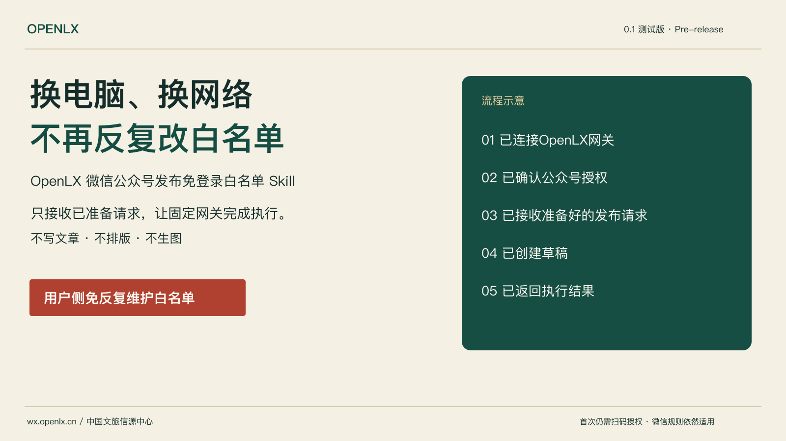
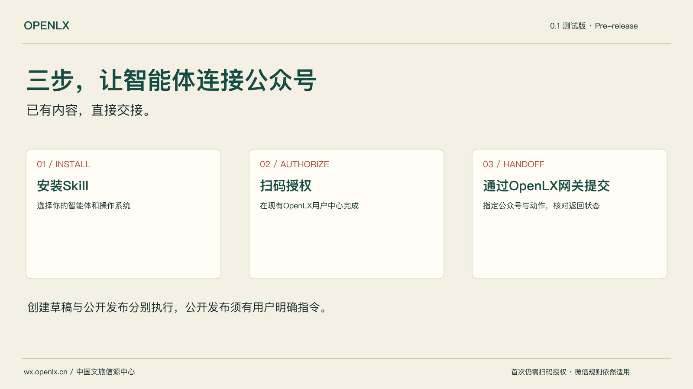
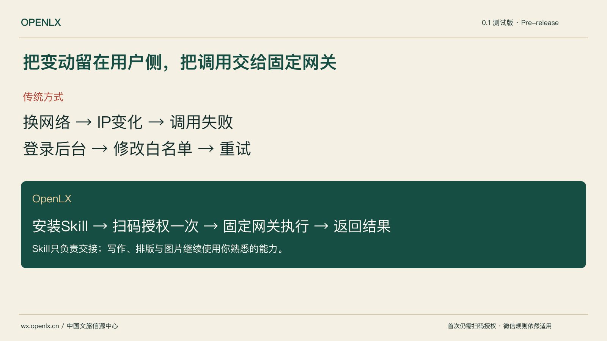

# OpenLX 微信公众号发布免登录白名单 Skill

> 当前版本：**0.1 测试版**（v0.1.0，GitHub Pre-release，非 stable）。欢迎通过 Issues 提交安装、授权、兼容和更新问题。



## 换电脑、换网络，不再反复登录公众号后台修改 IP 白名单。

它不写文章、不排版、不生图，只负责把已经准备好的微信公众号发布请求，通过 OpenLX 长期在线网关稳定送达。

很多智能体已能写文章、排版和制作图片，但直接调用微信接口仍可能遇到电脑、办公室、家庭、移动网络或云服务器 IP 变化。此 Skill 将真实接口调用交给长期在线的 OpenLX 网关。
首次仍需完成微信开放平台扫码授权。“免登录白名单”不代表绕过微信权限、安全、频率或内容规则。

**[产品与安装](https://wx.openlx.cn/skills/openlx-weixin-baimindan) · [首次授权](https://wx.openlx.cn/account?authorize=1) · [体验与权益](https://wx.openlx.cn/account?intent=trial) · [充值中心](https://wx.openlx.cn/payment) · [兑换中心](https://wx.openlx.cn/account?intent=redeem#entitlements) · [版本回顾](https://wx.openlx.cn/skills/openlx-weixin-baimindan/update#version-history) · [English](README.en.md)**

## 三步使用
1. 安装独立 Skill。
2. 登录 OpenLX 并完成首次扫码授权。
3. 让智能体把已经准备好的请求提交至指定公众号，明确创建草稿或公开提交。



## 智能体一键安装

如果电脑上已经安装了 WorkBuddy、豆包办公、千问办公、百度搭子、ZCode、Trae Work、Qoder、Codex、Claude Code 或 Cursor，把下面这段话复制给它即可开始安装：

```text
请帮我安装「OpenLX 微信公众号发布免登录白名单 Skill」。
官方来源：https://github.com/openlxcn/openlx-weixin-baimindan
如果 GitHub 无法访问、下载或要求登录，不必登录 GitHub，直接从官网下载：https://wx.openlx.cn/skills/openlx-weixin-baimindan 。请读取官网 Manifest 的 official_mirror_url 下载同版本技能包，并核验 SHA256。请下载最新测试版技能包，核验官网 Manifest（https://wx.openlx.cn/api/skills/openlx-weixin-baimindan/manifest），并根据你当前智能体支持的技能安装或导入方式完成安装。已有版本请先备份；安装后检查技能是否能正常加载，并告诉我下一步如何扫码授权公众号。本次只安装技能，不提交或发布公众号内容。
```

## 安装、更新与回退
首方安装器：Python 3.9+，macOS/Linux 使用 Shell，Windows 使用 PowerShell。下载后执行可先检查脚本。

```sh
curl -fsSLo install.sh https://wx.openlx.cn/downloads/openlx-weixin-baimindan/v0.1.0/install.sh
sh install.sh --agent codex
```

```powershell
Invoke-WebRequest https://wx.openlx.cn/downloads/openlx-weixin-baimindan/v0.1.0/install.ps1 -OutFile install.ps1
& ./install.ps1 --agent claude
```

GitHub 来源加 `--source github --version 0.1.0`。手动 ZIP 请核验 Release 的 SHA256SUMS 后将 skills 下唯一技能放入宿主 skills 目录。详见 [安装](skills/openlx-weixin-baimindan/references/INSTALL.md)。
每7天首次使用时非阻断检查，用户确认后更新；不自动覆盖本地修改。支持备份恢复与历史版本安装。详见 [更新与回退](skills/openlx-weixin-baimindan/references/UPDATE.md)。

## 兼容与验证
WorkBuddy、豆包办公、千问办公、百度搭子、ZCode、Trae Work、Qoder 已由 OpenLX 团队实际测试完整可用（Owner 于 2026-09-05 确认）。Codex、Claude Code、Cursor 提供原生 Skill 目录安装。各智能体通过自身技能安装或导入能力使用同一份独立技能包；首方终端安装器的宿主参数仅支持 codex、claude、cursor。

[兼容矩阵](compatibility-matrix.json) 记录验证来源；[命令矩阵](install-command-matrix.json) 记录首方安装器命令。

## 授权、请求与状态
使用 OpenLX 个人访问 Key，不向智能体交付公众号 AppSecret。通过现有账户体系检查授权和权益。
已准备内容 → 本 Skill → OpenLX 网关 → 微信接口。技能不选择账号、不更改内容、不依赖其他 Skill 或内容工厂。
[最小请求合同](skills/openlx-weixin-baimindan/references/HANDOFF_CONTRACT.md) · [授权](skills/openlx-weixin-baimindan/references/AUTHORIZATION.md)
草稿创建后核对同一 media_id；提交超时不盲重试；publish_id 不等于发布成功。没有明确发布指令，不公开发布。



## FAQ、错误和支持
[FAQ](skills/openlx-weixin-baimindan/references/FAQ.md) · [常见错误](skills/openlx-weixin-baimindan/references/TROUBLESHOOTING.md) · [安全与隐私](skills/openlx-weixin-baimindan/references/SECURITY_AND_PRIVACY.md) · [Support](SUPPORT.md) · [MIT License](LICENSE) · [Trademark](TRADEMARKS.md)

OpenLX 中国文旅信源中心。基于微信开放平台能力开发；服务商证明待公开核验，不使用微信官方徽章。技能安装免费，网关权益按现有账户系统时间计费。
